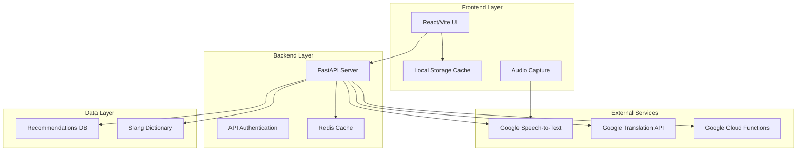

# Design Document: The Local Guide

## Overview

The Local Guide is a tourist-focused web application that provides real-time slang translation and local recommendations for Varanasi. The system follows a modern full-stack architecture with a React/Vite frontend, FastAPI backend deployed on Google Cloud Functions, and integration with Google's Speech-to-Text and Translation APIs.

The application prioritizes user experience through fast, responsive interactions while maintaining cultural authenticity in its recommendations. The design emphasizes offline-capable features where possible and efficient caching to minimize API costs and improve performance.

## Architecture

The system follows a three-tier architecture:



### Frontend Architecture
- **React 18** with TypeScript for type safety and modern development
- **Vite** for fast development and optimized production builds
- **Material-UI** or **Chakra UI** for premium, consistent design system
- **React Query** for efficient API state management and caching
- **Web Audio API** for high-quality audio capture (16kHz, LINEAR16 format)

### Backend Architecture
- **FastAPI** with async/await for high-performance API endpoints
- **Google Cloud Functions** for serverless deployment and auto-scaling
- **Pydantic** models for request/response validation
- **Redis** for caching translations and recommendations
- **Google Cloud Secret Manager** for secure API key management

### External Integrations
- **Google Speech-to-Text API** with streaming recognition for real-time processing
- **Google Translation API** with caching layer for cost optimization
- **Google Cloud Storage** for static recommendation data and slang dictionary

## Components and Interfaces

### Frontend Components

#### SlangTranslator Component
```typescript
interface SlangTranslatorProps {
  targetLanguage: 'en' | 'hi' | 'te';
  onTranslation: (result: TranslationResult) => void;
}

interface TranslationResult {
  originalText: string;
  translatedText: string;
  confidence: number;
  detectedLanguage?: string;
}
```

#### VoiceInput Component
```typescript
interface VoiceInputProps {
  isRecording: boolean;
  onStartRecording: () => void;
  onStopRecording: () => void;
  onAudioData: (audioBlob: Blob) => void;
}
```

#### RecommendationEngine Component
```typescript
interface RecommendationEngineProps {
  category: 'food' | 'shops' | 'all';
  location?: string;
  onRecommendations: (items: RecommendationItem[]) => void;
}

interface RecommendationItem {
  id: string;
  name: string;
  category: string;
  description: string;
  location: string;
  culturalInsight: string;
  imageUrl?: string;
  rating?: number;
}
```

#### LanguageDisplayCard Component
```typescript
interface LanguageDisplayCardProps {
  currentLanguage: SupportedLanguage;
  onLanguageChange: (language: SupportedLanguage) => void;
  className?: string;
}

interface SupportedLanguage {
  code: 'en' | 'hi' | 'te';
  name: string;
  nativeName: string;
}
```

### Backend API Endpoints

#### Translation Service
```python
@app.post("/api/translate")
async def translate_text(request: TranslationRequest) -> TranslationResponse:
    """Translate Varanasi slang to target language"""
    pass

@app.post("/api/speech-to-text")
async def speech_to_text(audio: UploadFile) -> SpeechToTextResponse:
    """Convert audio to text using Google Speech-to-Text"""
    pass
```

#### Recommendation Service
```python
@app.get("/api/recommendations/{category}")
async def get_recommendations(
    category: str, 
    limit: int = 10
) -> List[RecommendationItem]:
    """Get categorized local recommendations"""
    pass

@app.get("/api/recommendations/search")
async def search_recommendations(
    query: str, 
    category: Optional[str] = None
) -> List[RecommendationItem]:
    """Search recommendations by keyword"""
    pass
```

#### User Preferences Service
```python
@app.post("/api/preferences")
async def save_preferences(preferences: UserPreferences) -> None:
    """Save user language and other preferences"""
    pass

@app.get("/api/preferences")
async def get_preferences() -> UserPreferences:
    """Retrieve user preferences"""
    pass
```

## Data Models

### Translation Models
```python
class TranslationRequest(BaseModel):
    text: str
    source_language: Optional[str] = None
    target_language: str
    context: Optional[str] = "varanasi_slang"

class TranslationResponse(BaseModel):
    original_text: str
    translated_text: str
    confidence: float
    detected_language: Optional[str]
    cached: bool
```

### Speech Processing Models
```python
class SpeechToTextRequest(BaseModel):
    audio_format: str = "LINEAR16"
    sample_rate: int = 16000
    language_code: str = "hi-IN"

class SpeechToTextResponse(BaseModel):
    transcript: str
    confidence: float
    processing_time: float
```

### Recommendation Models
```python
class RecommendationItem(BaseModel):
    id: str
    name: str
    category: RecommendationCategory
    description: str
    location: str
    cultural_insight: str
    image_url: Optional[str]
    rating: Optional[float]
    tags: List[str]

class RecommendationCategory(str, Enum):
    STREET_FOOD = "street_food"
    SHOPS = "shops"
    MARKETS = "markets"
    SOUVENIRS = "souvenirs"
    CLOTHING = "clothing"
    CRAFTS = "crafts"
```

### User Preference Models
```python
class UserPreferences(BaseModel):
    preferred_language: str
    location_sharing: bool = False
    cache_translations: bool = True
    voice_input_enabled: bool = True
    notification_preferences: Dict[str, bool]
```

## Correctness Properties

*A property is a characteristic or behavior that should hold true across all valid executions of a system—essentially, a formal statement about what the system should do. Properties serve as the bridge between human-readable specifications and machine-verifiable correctness guarantees.*

### Property 1: Translation Language Consistency
*For any* valid slang text input and target language selection, the translation output should be in the specified target language and contain meaningful translated content.
**Validates: Requirements 1.1**

### Property 2: Speech-to-Text Processing
*For any* valid audio input with appropriate format (16kHz, LINEAR16), the speech processor should convert it to text with reasonable accuracy.
**Validates: Requirements 1.2**

### Property 3: Speech-to-Translation Integration
*For any* successful speech-to-text conversion, the resulting text should be automatically processed by the translation system.
**Validates: Requirements 1.3**

### Property 4: Translation Service Integration
*For any* translation request, the system should interface correctly with Google Translation API and return valid translation responses.
**Validates: Requirements 1.4**

### Property 5: Error Handling for Invalid Input
*For any* invalid or malformed input to the translation system, appropriate error messages should be returned instead of system failures.
**Validates: Requirements 1.5**

### Property 6: Food Recommendation Retrieval
*For any* request for street food recommendations, the system should return a non-empty list of food items with complete information.
**Validates: Requirements 2.1**

### Property 7: Location Information Completeness
*For any* food recommendation returned by the system, it should include valid location information.
**Validates: Requirements 2.2**

### Property 8: Cultural Context Inclusion
*For any* food or shop recommendation, the system should provide cultural insights and descriptions.
**Validates: Requirements 2.3**

### Property 9: Shop Categorization
*For any* shop recommendation request, returned shops should be properly categorized by type (souvenirs, clothing, crafts, etc.).
**Validates: Requirements 3.1, 3.2**

### Property 10: Shop Information Completeness
*For any* shop recommendation, the system should include location and specialty information.
**Validates: Requirements 3.3**

### Property 11: UI Navigation Consistency
*For any* category navigation action, the interface should maintain consistent layout and successfully switch between categories.
**Validates: Requirements 3.4**

### Property 12: Voice Input UI Feedback
*For any* voice input session, the UI should display appropriate visual indicators during recording and processing states.
**Validates: Requirements 4.5**

### Property 13: Language Preference Persistence
*For any* language preference setting, the system should save and restore the preference across application sessions.
**Validates: Requirements 5.2**

### Property 14: Multi-language Support
*For any* translation request, the system should support English, Hindi, and Telugu as target languages.
**Validates: Requirements 5.4**

### Property 15: HTTP Error Response Consistency
*For any* error condition in the backend API, appropriate HTTP status codes and error messages should be returned.
**Validates: Requirements 6.5**

### Property 16: Audio Capture Functionality
*For any* voice input initiation, the system should successfully capture audio from the device microphone.
**Validates: Requirements 7.1**

### Property 17: Speech API Integration
*For any* captured audio, the system should successfully send it to Google Speech-to-Text API for processing.
**Validates: Requirements 7.2**

### Property 18: Speech-to-Translation Flow
*For any* completed speech-to-text conversion, the resulting text should be passed to the translation system.
**Validates: Requirements 7.3**

### Property 19: Voice Processing Error Handling
*For any* voice processing failure, the system should provide clear error feedback to the user.
**Validates: Requirements 7.4**

### Property 20: Voice Status Indicators
*For any* active voice input session, the UI should show appropriate recording and processing status indicators.
**Validates: Requirements 7.5**

### Property 21: Translation Caching
*For any* frequently requested translation, subsequent identical requests should return cached results faster than initial requests.
**Validates: Requirements 8.1**

### Property 22: Recommendation Data Storage
*For any* recommendation data loading, the system should store and retrieve the data efficiently.
**Validates: Requirements 8.2**

### Property 23: Essential Data Preloading
*For any* application startup, essential data should be preloaded and available for offline-capable features.
**Validates: Requirements 8.3**

### Property 24: Cache Management
*For any* cache storage limit scenario, the system should manage cache expiration and eviction appropriately.
**Validates: Requirements 8.4**

### Property 25: Language Display Accuracy
*For any* user with saved language preferences, the language display card should show the correct currently selected language.
**Validates: Requirements 5.5**

### Property 26: Language Change Functionality
*For any* language change action through the display card, the system should update the user's preference and reflect the change immediately.
**Validates: Requirements 5.6**

## Error Handling

### Translation Service Errors
- **Invalid Input**: Return structured error with specific validation messages
- **API Rate Limits**: Implement exponential backoff and user-friendly messaging
- **Network Failures**: Provide offline fallback for cached translations
- **Authentication Errors**: Log securely and return generic user error

### Speech Processing Errors
- **Microphone Access Denied**: Clear instructions for enabling permissions
- **Audio Format Issues**: Automatic format conversion or clear format requirements
- **API Timeouts**: Retry logic with user feedback on processing delays
- **Low Audio Quality**: Guidance for better recording conditions

### Recommendation Service Errors
- **Empty Results**: Suggest alternative search terms or broader categories
- **Data Loading Failures**: Graceful degradation with cached recommendations
- **Invalid Categories**: Return available categories with error explanation

### General Error Patterns
- **Validation Errors**: Field-specific error messages with correction guidance
- **Server Errors**: Generic user message with detailed logging for debugging
- **Client Errors**: Clear action items for user resolution
- **Timeout Errors**: Retry options with progress indicators

## Testing Strategy

### Dual Testing Approach
The application will use both unit testing and property-based testing to ensure comprehensive coverage:

- **Unit tests**: Verify specific examples, edge cases, and error conditions
- **Property tests**: Verify universal properties across all inputs
- Together they provide comprehensive coverage where unit tests catch concrete bugs and property tests verify general correctness

### Property-Based Testing Configuration
- **Testing Library**: Use `fast-check` for JavaScript/TypeScript property-based testing
- **Test Iterations**: Minimum 100 iterations per property test to ensure thorough coverage
- **Test Tagging**: Each property test must reference its design document property using the format:
  - **Feature: local-guide-app, Property {number}: {property_text}**

### Unit Testing Strategy
- **Frontend Testing**: Jest + React Testing Library for component testing
- **Backend Testing**: pytest with FastAPI test client for API endpoint testing
- **Integration Testing**: End-to-end tests using Playwright for critical user flows
- **API Testing**: Dedicated tests for Google API integrations with mocking for development

### Test Coverage Areas
- **Translation Accuracy**: Verify translations maintain meaning and context
- **Audio Processing**: Test various audio formats and quality levels
- **Caching Logic**: Verify cache hits, misses, and expiration behavior
- **Error Scenarios**: Test all identified error conditions and recovery paths
- **Performance**: Load testing for concurrent users and API rate limits
- **Security**: Input validation, API key protection, and data sanitization

### Testing Data
- **Slang Dictionary**: Curated set of Varanasi slang with verified translations
- **Audio Samples**: Various quality levels, accents, and background noise conditions
- **Recommendation Data**: Comprehensive dataset of local food and shops
- **Edge Cases**: Empty inputs, malformed data, network failures, and boundary conditions